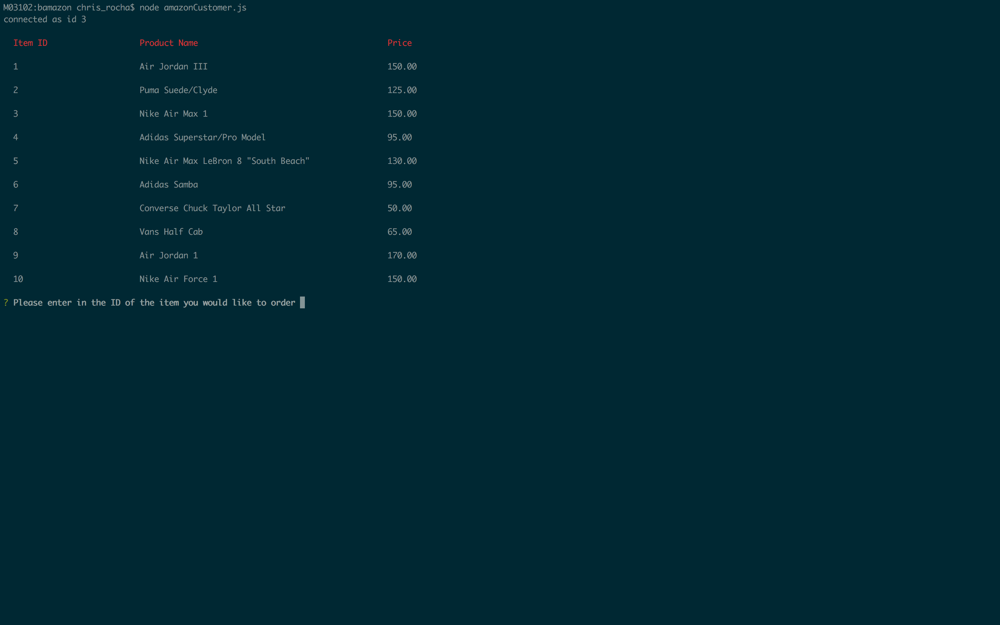
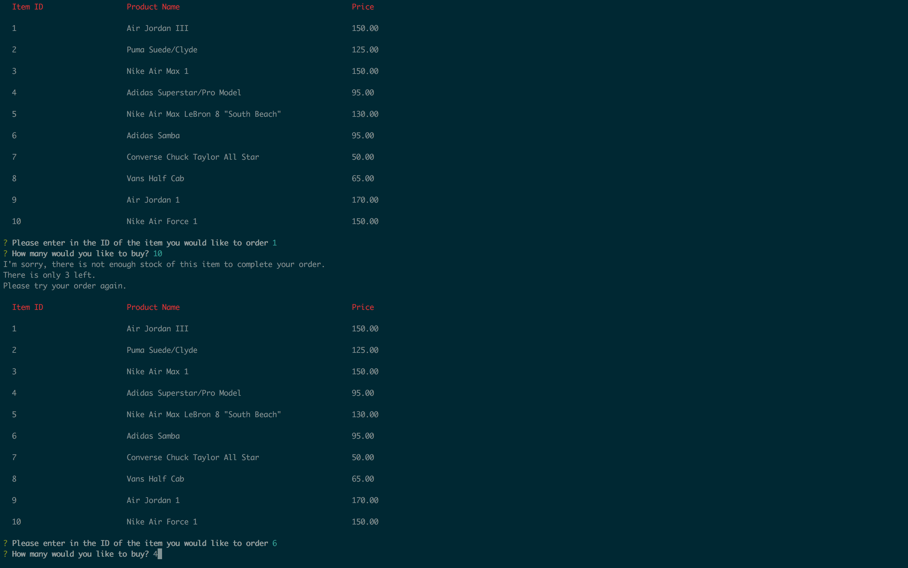
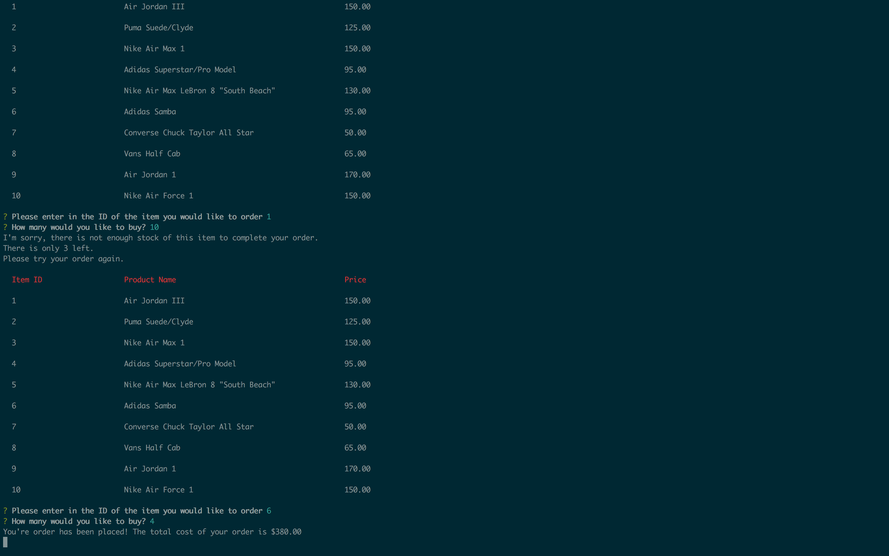
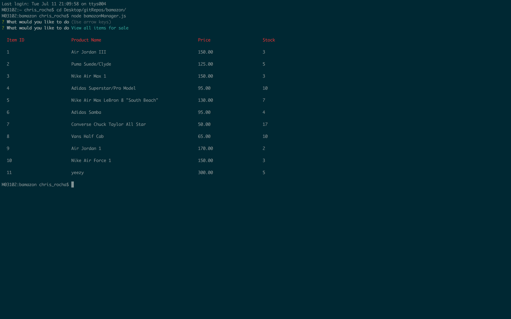

# bamazon
a CLI app that imitates an online ordering application

## How to use amazonCustomer.js
1. Run the file using the command prompt
1. You will have a list of items that are for sale returned. You will enter the Item Id of the item you want to purchase, as well as the amount.

1. If the item does not have enough stock you will be prompted about this and will have the opportunity to purchase another item.

1. If there is enough stock of the item you would like to purchase the order will go through.

## How to use bamazonManager.js
1. Run the file using the command prompt and choose the appropriate option.

1. Choose the first option to see all items for sale

1. Choose the option to view low inventory for all items where the stock is under 5 items.

1. Choose the add an item option to add a new product to your catalog.

